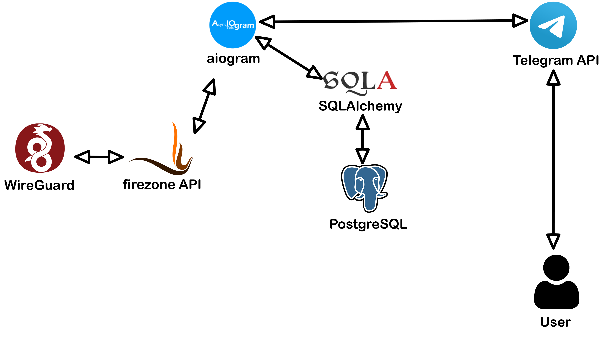
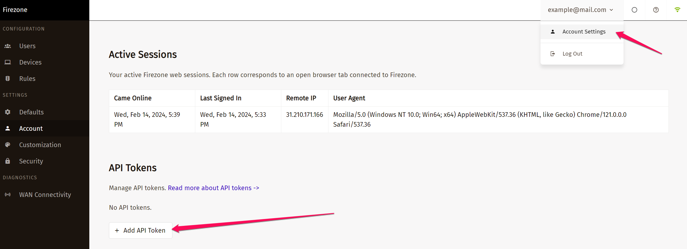
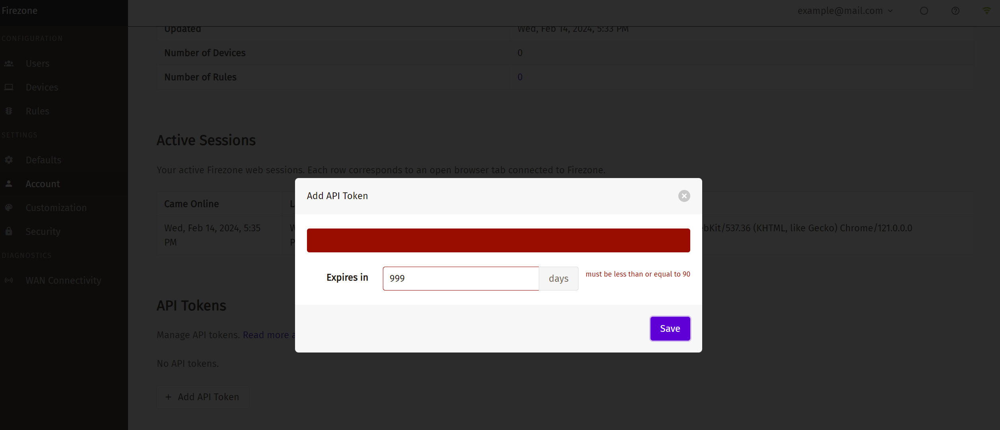
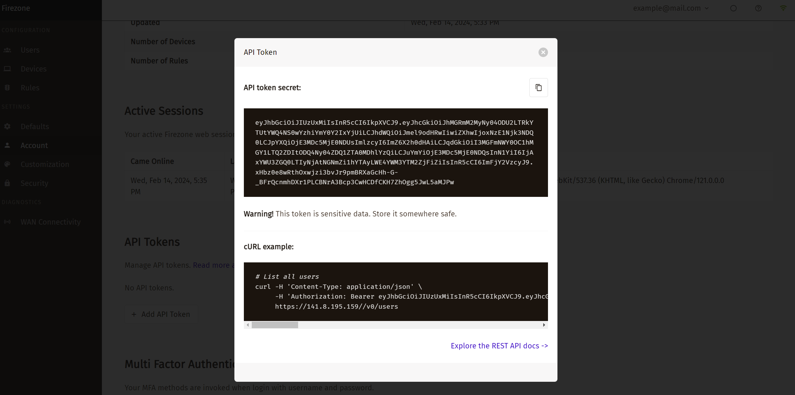
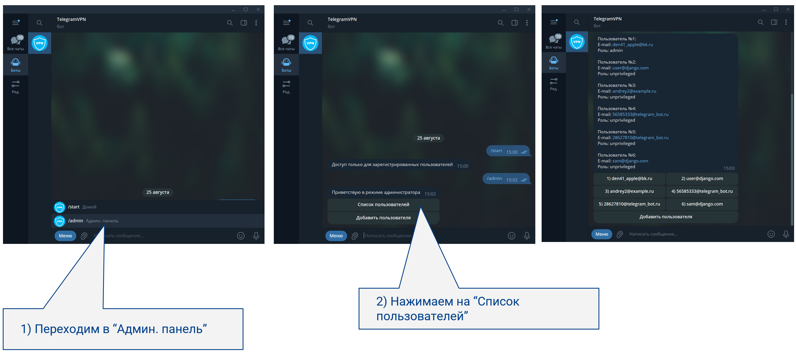
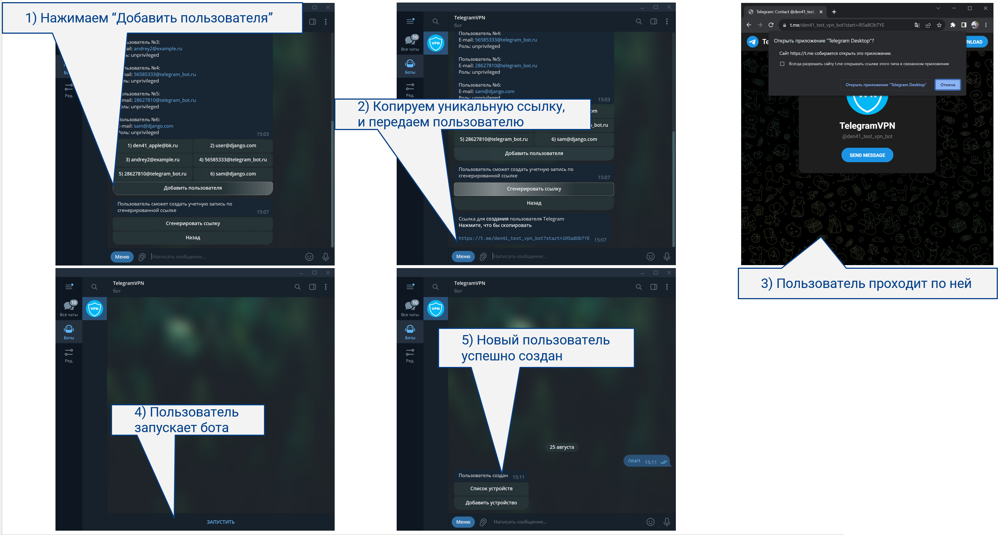
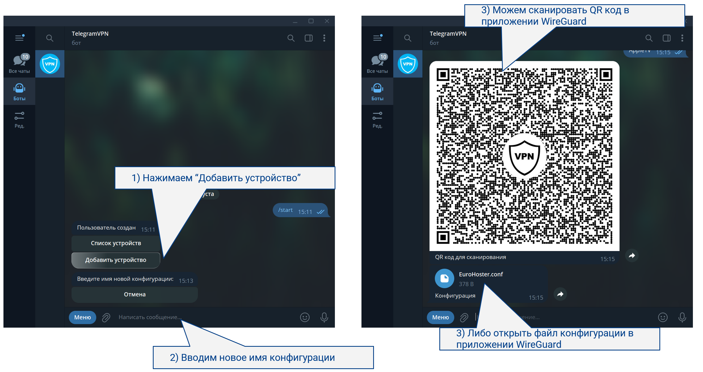
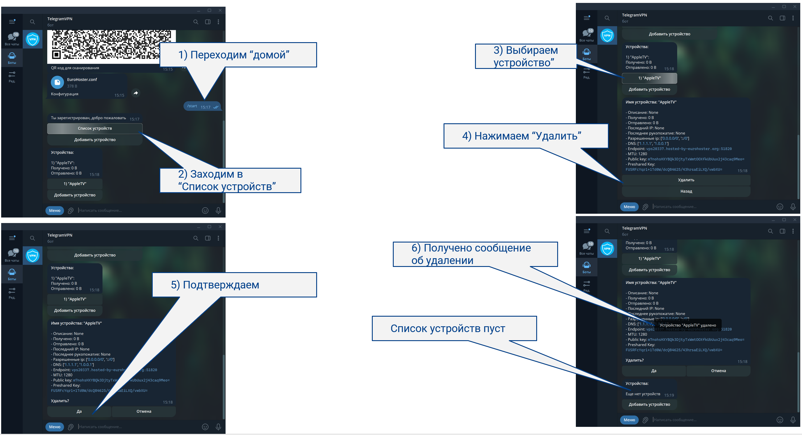
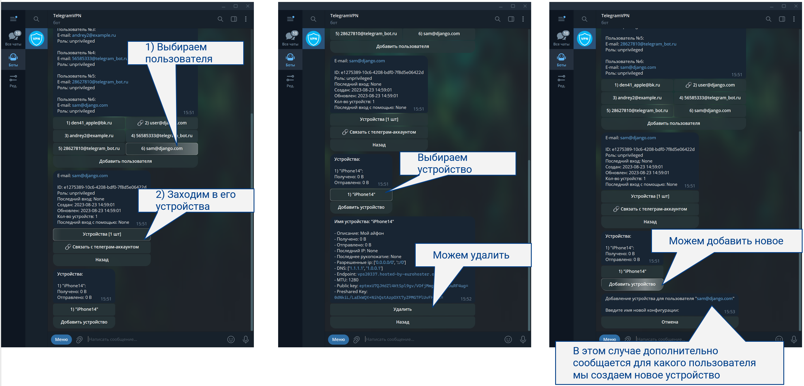

# Защита проекта: "Система управления VPN Сервером"

## Введение
Представляю проект - телеграм бот, который позволяющий управлять конфигурациями VPN на основе протокола WireGuard. 
Этот проект разработан с целью обеспечить удобное управление конфигурациями с VPN на базе open-source проекта [Firezone](https://www.firezone.dev/) через удобный интерфейс Telegram.

## Зачем?
VPN может понадобиться не только для обхода блокировок, как многие привыкли думать в последние годы, а в первую очередь для создания приватной сети.
Например, для безопасного доступа к ресурсам сети на работе находясь дома

## Почему именно WireGuard?
WireGuard это самый быстрый VPN протокол, при этом обеспечивающий достаточную конфиденциальность соединения

## Используемые технологии
-  Для удобного развертывания в изолированной среде
-  БД для учета пользователей
-  Асинхронный фреймворк для Телеграм бот API
-  Асинхронный http клиент для работы с API
-  Миграции схем БД
-  Удобный менеджер зависимостей
-  Open-source система управления WireGuard, и предоставляющая API
-  Популярный протокол VPN
-  Для запросов в БД

## Архитектура проекта 


## Установка

### Docker
Для установки Firezone необходим Docker, его можно установить простой командой 
```shell 
curl https://get.docker.com | sh
```

###  Firezone
Заходим по ссылке для установки в Docker контейнере https://www.firezone.dev/docs/deploy/docker

Выполняем shell команду для автоматической установки 
```shell 
bash <(curl -fsSL https://github.com/firezone/firezone/raw/legacy/scripts/install.sh)
```

Нас спросят про email, путь установки и т.д.:
Если есть домен, можно указать домен вместо ip адреса
```
root@box-753019:~# bash <(curl -fsSL https://github.com/firezone/firezone/raw/legacy/scripts/install.sh)
Enter the administrator email you'd like to use for logging into this Firezone instance: example@mail.com
Enter the desired installation directory (/root/.firezone):
Enter the external URL that will be used to access this instance. (https://box-753019): https://141.8.195.159
Could we email you to ask for product feedback? Firezone depends heavily on input from users like you to steer development. (Y/n): n
Firezone collects crash and performance logs to help us improve the product. Would you like to disable this? (N/y): y
Press <ENTER> to install or Ctrl-C to abort.
```

Далее пойдет скачивание Docker образов, инициализация конфигурации и запуск приложения <br>
По окончанию нас будет ждать подобное сообщение
```
                                      ::
                                       !!:
                                       .??^
                                        ~J?^
                                        :???.
                                        .??J^
                                        .??J!
                                        .??J!
                                        ^J?J~
                                        !???:
                                       .???? ::
                                       ^J?J! :~:
                                       7???: :~~
                                      .???7  ~~~.
                                      :??J^ :~~^
                                      :???..~~~:
    .............                     .?J7 ^~~~        ....
 ..        ......::....                ~J!.~~~^       ::..
                  ...:::....            !7^~~~^     .^: .
                      ...:::....         ~~~~~~:. .:~^ .
                         ....:::....      .~~~~~~~~~:..
                             ...::::....   .::^^^^:...
                                .....:::.............
                                    .......:::.....

Installation complete!

You should now be able to log into the Web UI at https://141.8.195.159 with the
following credentials:

DEFAULT_ADMIN_EMAIL=example@mail.com
DEFAULT_ADMIN_PASSWORD=Tr66oHDtKgLAoDX2
```
Заходим на веб интерфейс и радуемся собственным VPN сервисом с админкой!


### Проект на Python
#### Посмотрим на переменные окружения необходимые для запуска

```ini
TG_TOKEN = "..."  # Токен телеграм бота
TG_ADMINS = 123,456  # chat_id администраторов через запятую 

# FIREZONE
FZ_HOST = "https://..."  # Хост установленного ранее Firezone
FZ_TOKEN = "7dF8...."  # Сгенерированный токен
```
Нам от Firezone еще необходимо получить `FZ_TOKEN`
Для этого в веб интерфейсе заходим под учетной записью администратора <br>
**В настройках аккаунта нажимаем "Add API Token"** <br>
 <br>
**Максимально разрешено создавать токены сроком до 90 дней** <br>
 <br>
**Получаем наш `FZ_TOKEN`** <br>
 <br>

####  Можно приступать к развертыванию Python приложения
Для этого достаточно выполнить команды:
```shell
docker compose build
docker compose up -d
```
🎉 Вы великолепны! <br>
Теперь можно переходить к использованию своего замечательного продукта 🙌


## Посмотрим со стороны пользователя

### 1. Админ панель, список пользователей
Будучи администратором, можно посмотреть существующих пользователей



### 2. Добавление пользователя через генерацию ссылки
Здесь я думал, каким образом можно сделать удобное добавление пользователя администратору
Так как, для разрешения доступа, все-таки необходимо прописать этого пользователя в БД, а вместе с этим, для его идентификации, еще и дополнительные данные о нем.
И мне пришла мысль делать временные deep link (передача параметра при запуске бота) которую позволяет сделать Telegram API
Таким образом проблема с заполнением данных автоматически решится



### 3. Добавление конфигурации устройства своему пользователю
Введя всего-лишь имя конфигурации, по сути, имя устройства, например iPhone 14, пользователь создает её
При этом, прочитать конфигурацию приложением можно наведя камерой другого телефона, если, например ты даешь доступ другому человеку
Либо, файлом, что удобней, например, если ты делаешь конфигурацию для себя



### 4. Список устройств, детали, удаление
Можно посмотреть список созданных конфигураций для устройств, зайти в каждое из них, и посмотреть статистику потребления трафика
Так же, можно удалить конфигурацию



### 5. Админ. панель, добавление и удаление устройств у *других пользователей*
Вернемся к админ панели
Будучи администратором мы можем сделать все то же самое от лица другого пользователя, например если друг попросил добавить конфигурацию, но по какой-то причине не имеет доступ к своему телеграму




## Преимущества проекта
- Удобное управление VPN через Telegram
- Безопасность и надежность и скорость VPN соединения благодаря использованию протокола WireGuard
- Гибкость и расширяемость благодаря управлению пользователями и устройствами с помощью Firezone

## Выводы и планы по развитию
1. Необходимо переписать диалоги в боте, красиво отформатировать их, и написать инструкции по установке приложений и подключению
2. Добавить дополнительные сценарии на различные случаи, либо ошибки, которые могут возникнуть
3. Реализовать возможность оплаты

## Заключение
Этот проект рожден не для галочки в конце курса, а для реального использования. <br>
С помощью него можно быстро настроить защищенный доступ к внутренним сервисам компании

Кроме того, на текущий момент в личных целях очень актуально использовать свой VPN сервер, и делиться им со своими друзьями и родными